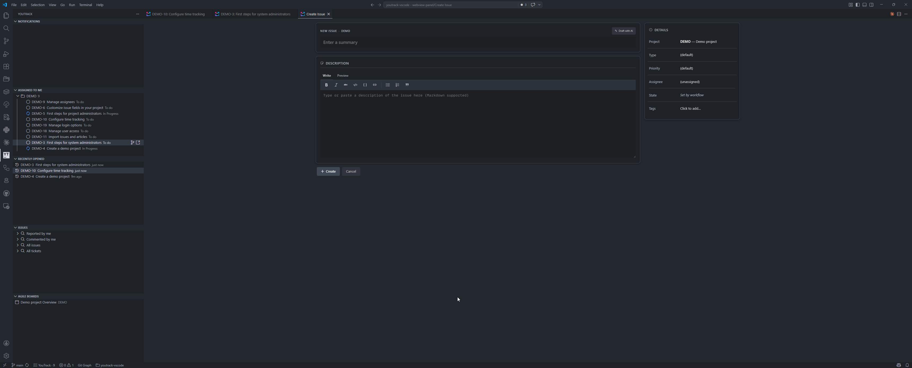
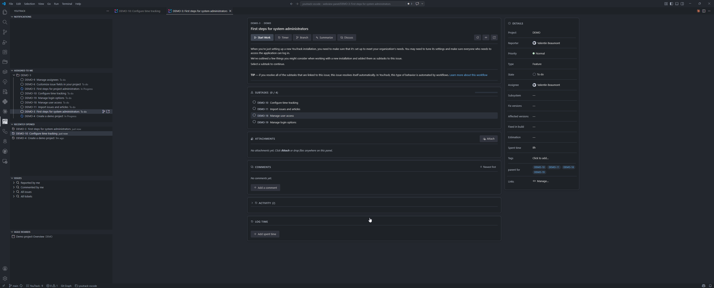
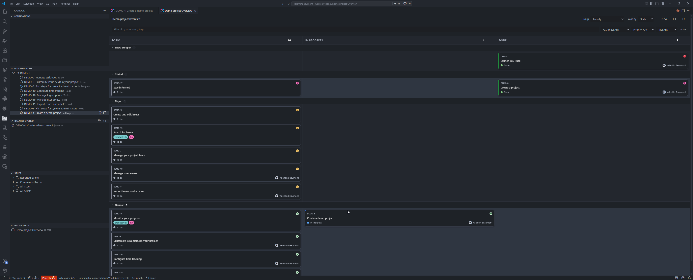

# YouTrack Companion

[](https://marketplace.visualstudio.com/items?itemName=healkeiser.youtrack-companion)
[](https://open-vsx.org/extension/healkeiser/youtrack-companion)
[](https://github.com/healkeiser/youtrack-companion/releases/latest)
[](./LICENSE)

> Distributed via the **[VS Code Marketplace](https://marketplace.visualstudio.com/items?itemName=healkeiser.youtrack-companion)**, **[Open VSX](https://open-vsx.org/extension/healkeiser/youtrack-companion)** (for VSCodium / Cursor / Theia), and direct **[GitHub Releases](https://github.com/healkeiser/youtrack-companion/releases)**.
>
> If you previously installed it as `valentinbeaumont.youtrack-vscode` or `valentinbeaumont.youtrack-companion`, those identifiers are retired. Uninstall the old extension and install `healkeiser.youtrack-companion`. Settings under the `youtrack.*` namespace are preserved across the switch — no reconfiguration needed.

A third-party YouTrack Cloud companion for Visual Studio Code. Sidebar, full-fidelity issue detail, agile board, time tracking, and a pile of editor-native workflows that turn the extension into a **"create a ticket and keep coding"** loop rather than a **"read tickets while coding"** loop.

Built by [Valentin Beaumont](https://github.com/healkeiser). Not affiliated with JetBrains.

## Install

### VS Code (Microsoft Marketplace)
`Ctrl+Shift+P` → **Extensions: Install Extensions** → search **YouTrack Companion** by `healkeiser`.
Or from the command line: `code --install-extension healkeiser.youtrack-companion`.

### VSCodium / Cursor / Theia / Gitpod (Open VSX)
Search **YouTrack Companion** in the Extensions sidebar — those editors talk to Open VSX out of the box.

### Manual / air-gapped / corporate setups
A single universal `.vsix` ships per release — same artifact across Windows, macOS, and Linux because the AI features spawn the user's own `claude` CLI rather than bundling per-platform binaries.

```powershell
# Windows / PowerShell
$asset = (Invoke-RestMethod https://api.github.com/repos/healkeiser/youtrack-companion/releases/latest).assets `
  | Where-Object name -like '*.vsix' | Select-Object -First 1
Invoke-WebRequest $asset.browser_download_url -OutFile $asset.name
code --install-extension $asset.name
```

```bash
# macOS / Linux
URL=$(curl -s https://api.github.com/repos/healkeiser/youtrack-companion/releases/latest \
  | grep browser_download_url | grep '\.vsix' | head -1 | cut -d '"' -f 4)
curl -L -o youtrack-companion.vsix "$URL"
code --install-extension youtrack-companion.vsix
```

Or just download the `.vsix` from the [latest release page](https://github.com/healkeiser/youtrack-companion/releases/latest) and drag-and-drop it into the Extensions sidebar.

## Quick start

1. Install via one of the methods above.
2. `Ctrl+Shift+P` → **YouTrack: Sign In**.
3. Enter your YouTrack Cloud base URL (e.g. `https://<org>.youtrack.cloud/`).
4. Paste a permanent token. Generate one in YouTrack: **avatar → Profile → Account Security → New token**, scope it to **YouTrack** (not read-only).
5. Open the YouTrack activity-bar icon on the left and pick a view.

## Screenshots

| Sidebar + Create Issue | Issue detail | Agile board |
| --- | --- | --- |
|  |  |  |

## Features

### Sidebar
- Five views in a dedicated activity-bar container: **Notifications**, **Assigned to me**, **Recently opened**, **Issues**, **Agile Boards**.
- Per-view filter state: text filter, state filter, tag filter, `#Unresolved` toggle (on by default for _Assigned to me_), sort mode, group-by-project. Filters on _Assigned to me_ don't bleed into the _Issues_ umbrella and vice-versa.
- _Issues_ view rolls up **Reported by me**, **Commented by me**, **All issues**, **All tickets** under a single section.
- Right-click any issue → change state, assign to me, log time, create branch, copy ID/link, open in browser.

### Issue detail panel
- Two-column layout with a sticky side panel. Every side-panel row — State, Priority, Assignee, and every project custom field (enum, state, user, version, bool, date, period, string, int, float) — is a clickable pill that opens a type-aware editor.
- **Subtasks section** with a live progress bar (`done / total`) and clickable child-issue rows that deep-link into their own panels.
- Editable summary and description with Markdown **Write**/**Preview** tabs, a full formatting toolbar (bold, italic, strikethrough, code, code block, link, quote, bullet/numbered lists, mention), and double-click-to-edit.
- **Comment drafts** auto-persist per issue in `globalState` — close the panel, reload the window, or accidentally `Ctrl+W` the tab; your draft is still there when you return.
- **@mention autocomplete** with a VS Code-styled dropdown against the workspace user roster (arrow keys, Enter/Tab to accept, Esc to dismiss, click to pick).
- **Reactions** on comments — click the smiley next to Edit to add/remove emoji reactions; existing reactions render as pills with counts and a toggle on click.
- **Restricted-visibility badge** on comments with a `LimitedVisibility` constraint (shows the group/user label on hover).
- **Activity feed** with inline edit on your own comments, VCS commits, and state/field changes rendered as semantic verbs. Work-item log-time form with a collapsible "Add time" trigger. Drag-and-drop attachments onto the panel.
- **Panel keyboard shortcuts**: `C` focus comment box · `R` toggle activity sort · `E` edit description · `?` show cheat sheet.
- Toolbar: **Start Work** (transition + branch), **Timer**, **Branch**, Refresh, Copy Link, Open in browser.

### Agile board
- Sprint picker, swimlane grouping (by Priority, Assignee, or State) or flat view, column sorting (recently updated / created / ID / summary).
- Drag cards across columns to transition state, with a dashed drop-zone outline and focus highlight while dragging.
- **Per-column `+` button** to create a new issue pre-seeded with that column's state.
- **In-memory filters**: text search (id/summary/tag) + Assignee / Priority / Tag dropdowns. Filters persist across sprint switches and window reloads.
- **Create Issue** button opens the form panel pre-selected to the current board's project.

### Create Issue
- Two-column form panel mirroring the detail shell. Project, Type, Priority, Assignee on the right; full Markdown editor on the left with the same toolbar/tabs as comments.
- **Create from editor selection**: right-click on selected code → **YouTrack: Create Issue from Selection**. Pre-fills summary with `filename.ts:42-58 — first line of snippet` and description with a fenced code block keyed to the document's language id.

### Time tracking
- Live timer with a status-bar item (per-second ticker) that persists across window reloads. Stopping rounds up and posts a work item automatically.
- Standalone **Log Time** form on the issue panel for manual entries, with configurable work-item types.

### Git integration
- **Branch from issue** with a configurable template — `youtrack.branch.template` supports `{id}`, `{summary}`, `{type}`, `{state}`, `{assignee}`, `{project}`, and `{field:<CustomFieldName>}` placeholders. Sanitized tokens (lowercase, diacritic-stripped, separator-joined) with a configurable length cap on `{summary}`.
- **Current-issue status-bar badge** that reads the current git branch, extracts the issue key, and shows `$(tasklist) ID` with a rich tooltip.
- **Branch-aware command palette**: `YouTrack: Go to Issue by ID`, `Transition State`, and friends pre-fill the input with the issue key from the current branch when you have no argument.
- **Commit message template**: when the current branch contains an issue key, the SCM input box auto-fills from `youtrack.commit.template` (default `{id}: `). Three auto-fill modes — `off`, `empty-only` (default, inserts once on branch change), `always` (re-inserts after each commit) — plus a manual `YouTrack: Insert Issue Key in Commit Message` command.
- **Post branch activity**: manual command that collects commits ahead of upstream on the current branch and posts them as a markdown bullet list comment on the linked issue (confirm / edit / cancel).

### Editor-surface affordances
- **Hover** any `ABC-123`-shaped token in any file → summary, state, assignee, quick-open link.
- **CodeLens** above any `TODO` / `FIXME` / `XXX` / `HACK` / `NOTE` comment referencing an issue key → `ABC-123 · In Progress · <summary>`; click opens the panel. With AI enabled, a second `$(sparkle) Ask Claude` lens opens the same TODO in your Claude Code terminal pre-loaded with the issue context.
- **Quick Fix** on bare TODO/FIXME/XXX/HACK/NOTE comments (no issue id yet) — `Ctrl+.` → **Create YouTrack issue from this TODO**. AI drafts the ticket from surrounding code, you review in the Create Issue panel, and the line is rewritten to include the new id on submit.
- **URI handler**: `vscode://healkeiser.youtrack-companion/ABC-123` opens the issue.

### AI assist (Claude integration)

> Optional. Off by default — enable with `youtrack.ai.enabled = true`. Requires [Claude Code](https://claude.com/claude-code) installed and on `PATH`; auth is inherited from whatever Claude Code is signed into (personal Max plan, Team plan, API key, Bedrock, Vertex).

- The extension spawns the user's own `claude` CLI in `--print --output-format stream-json` mode and pipes events through the YouTrack MCP server (`<host>/mcp`). No SDK is bundled — the `.vsix` stays under 1MB instead of carrying a per-platform Claude Code binary. No API key in extension settings.
- **Summarize Issue** — sidebar context menu, panel toolbar, or `youtrack.ai.summarizeIssue`. Streams a structured TL;DR / Context / Open questions / Next steps into a markdown doc beside your editor.
- **Discuss in Claude Code Terminal** — pipes issue context + your branch/commit conventions into an existing `claude` terminal session (or spawns a new one). Bracketed-paste so the prompt arrives as a single block, not character-by-character.
- **Create Issue with AI** — `youtrack.ai.createIssue` quick-picks _free-form_ / _from editor selection_ / _from clipboard_. The agent drafts summary + description + project / type / priority / tag suggestions, optionally surfaces near-duplicates via the YouTrack MCP, and opens the existing Create Issue panel pre-filled. You always review and submit — the agent never files tickets directly.
- **Quick Fix on bare TODOs** — see _Editor-surface affordances_ above. The Code Action drafts an issue from the surrounding code, opens the Create Issue panel, and on submit rewrites the original line with the new id (configurable format, defaults to `# TODO ABC-123`).
- **Conventions baked in** — every prompt and terminal handoff includes your `youtrack.branch.template` / `youtrack.commit.template` settings, so drafted branch names and commit messages match exactly what _Create Branch_ and _Insert Issue Key_ would produce locally.
- **Sidebar auto-refresh** — when the agent calls a YouTrack MCP write tool (`update_issue`, `add_comment`, `transition_state`, …), a PostToolUse hook invalidates the cache and the sidebar trees / any open detail or board panels reflect the change without a manual refresh. Same plumbing reacts to manual mutations from the sidebar context menu or detail panel.
- **Logs** — `YouTrack: Show Logs` opens the diagnostics output channel.

### Notifications
- Unread notifications render with a `bell-dot` icon; inline `✓` to mark one read or a **Mark All as Read** action in the view toolbar.

### Quality
- Strict CSP with per-load script nonces on every webview, `sanitize-html` on all rendered Markdown, no inline scripts, no `eval`.
- Friendly error handling: YouTrack Cloud's "read-only mode" (maintenance windows) renders as a single coalesced notice instead of raw JSON; 401/403 point to the sign-in command; other server errors render just the `error_description`.
- Caches (user avatars, field color dots) prune entries older than 30 days on startup to keep `globalStorage` lean.

## Keyboard shortcuts

### Global

| Action | Windows / Linux | macOS |
| --- | --- | --- |
| Create issue | `Ctrl+Alt+N` | `Cmd+Alt+N` |
| Go to issue by ID | `Ctrl+Alt+G` | `Cmd+Alt+G` |
| Search issues | `Ctrl+Alt+Y` | `Cmd+Alt+Y` |
| Open board | `Ctrl+Alt+B` | `Cmd+Alt+B` |

### Inside the issue panel

| Key | Action |
| --- | --- |
| `C` | Focus the new-comment box |
| `R` | Toggle activity-feed sort (oldest / newest first) |
| `E` | Edit description |
| `?` | Show the cheat sheet |

## Settings

Highlights (full list under **Settings → Extensions → YouTrack**):

| Setting | Default | What it does |
| --- | --- | --- |
| `youtrack.baseUrl` | — | YouTrack Cloud URL. |
| `youtrack.defaultProject` | — | Project short name used when creating issues. |
| `youtrack.branch.template` | `{assignee}/{id}-{summary}` | Branch-name template. Supports `{id}`, `{summary}`, `{type}`, `{state}`, `{assignee}`, `{project}`, `{field:<Name>}`. |
| `youtrack.branch.summaryMaxLength` | `40` | Character cap on the sanitized `{summary}` token. |
| `youtrack.branch.separator` | `-` | Separator inside sanitized tokens. |
| `youtrack.commit.template` | `{id}: ` | SCM input prefix. Put `{id}` anywhere. |
| `youtrack.commit.autoFill` | `empty-only` | `off` / `empty-only` / `always`. |
| `youtrack.cache.pollInterval` | `60` | Background refresh cadence (seconds). |
| `youtrack.ai.enabled` | `false` | Master switch for AI features. Requires Claude Code installed locally. |
| `youtrack.ai.model` | `claude-sonnet-4-6` | Model used for AI features. |
| `youtrack.ai.permissionMode` | `default` | How tool-use permissions are handled (`default` prompts, `acceptEdits`, `bypassPermissions`, `plan`). |
| `youtrack.ai.maxTurns` | `12` | Max agent turns per request. |
| `youtrack.ai.draft.checkDuplicates` | `true` | When drafting a new issue, search YouTrack for near-duplicates and surface them as a soft warning. |
| `youtrack.ai.codeActions.replaceTodoWithIssueId` | `true` | After filing from a TODO Quick Fix, rewrite the original line to include the new issue id. |
| `youtrack.ai.codeActions.todoIdFormat` | `{marker} {id}` | Format applied when stamping the issue id onto a TODO comment. |

## Security

All webviews run under a restrictive CSP:

```
default-src 'none';
style-src  {webview}  'unsafe-inline';
font-src   {webview};
script-src 'nonce-<per-load>';
img-src    {webview}  https: data:;
connect-src {webview};
frame-src  'none';
```

No inline scripts, no `eval`, no third-party CDN assets. Rendered markdown (comments, descriptions, work-item notes) passes through `sanitize-html` with an explicit allow-list of tags and schemes before hitting the DOM.

## Develop

```bash
npm install
npm run build        # esbuild bundle → dist/extension.js
npm test             # vitest unit suite
npx vsce package     # → youtrack-vscode-<ver>.vsix
```

Pull requests welcome at [healkeiser/youtrack-companion](https://github.com/healkeiser/youtrack-companion).

## License

MIT. See [LICENSE](./LICENSE).

---

YouTrack and JetBrains are trademarks of JetBrains s.r.o. This extension is an independent community project and is not affiliated with, endorsed by, or sponsored by JetBrains.
